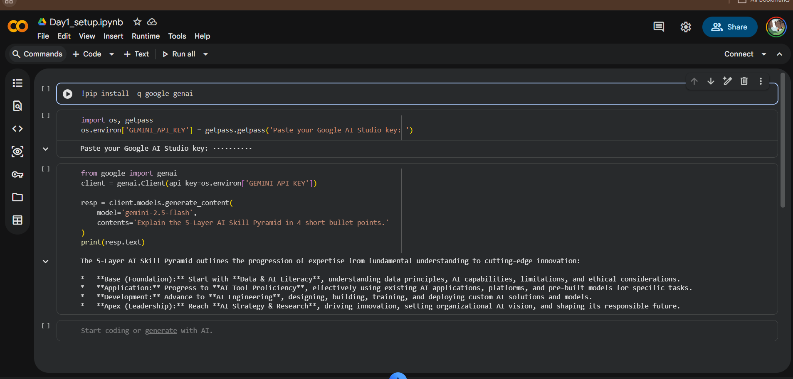

# AI Mentor Bootcamp Portfolio — Penke Bhavya Teja

Welcome to my AI Mentor Bootcamp portfolio.

This repository documents my journey through a 12-Day AI Mentor Bootcamp where I learn, build, evaluate, and deploy practical AI solutions using modern LLMs, automation tools, structured outputs, verification frameworks, and AI applications.

---

## 👨‍💻 About Me

* Name: P Bhavya Teja
* Role: AI Bootcamp Participant
* Focus Areas:

  * Generative AI
  * Prompt Engineering
  * AI Evaluation
  * LLM Application Development
  * Workflow Automation
  * Responsible AI

---

# 🛠 Technology Stack

### AI Models

* ChatGPT
* Claude
* Gemini
* Perplexity

### Development Tools

* Python
* Google Colab
* GitHub
* Pydantic
* Hugging Face
* n8n
* Docker

### APIs

* Gemini API
* Groq API
* Hugging Face Inference API

---

# 📅 Day 1 — AI Playground & Toolkit Setup

## Lab 1A — AI Playground

### Objective

Compare four AI systems across:

* Summarization
* Coding
* Reasoning

### Comparison Matrix

| Tool       | Summarize | Code | Reason | Verdict             |
| ---------- | --------- | ---- | ------ | ------------------- |
| ChatGPT    | 4/5       | 4/5  | 4/5    | Strong all-rounder  |
| Claude     | 5/5       | 4/5  | 5/5    | Excellent reasoning |
| Gemini     | 4/5       | 3/5  | 3/5    | Fast and practical  |
| Perplexity | 4/5       | 3/5  | 2/5    | Best for research   |

### Key Learning

Different AI systems excel at different tasks. Verification remains essential regardless of model quality.

---

## Lab 1B — Toolkit Setup

### Deliverables

* ✅ Gemini API Key
* ✅ Groq API Key
* ✅ Public GitHub Repository
* ✅ Google Colab Notebook
* ✅ First Gemini API Call

### Notebook

* [Day1_Setup.ipynb](Day1_Setup.ipynb)

### Screenshot



### Outcome

Successfully connected to Gemini API using the official Google GenAI SDK and executed the first model call.

---

# 📅 Day 2 — Prompt Engineering & Structured Output

## Lab 2A — Six Prompting Patterns

### Patterns Practiced

1. Persona Prompting
2. Few-Shot Prompting
3. Chain-of-Thought
4. Structured Output
5. System Prompting
6. Prompt Chaining

### Deliverable

* [Day2_SixPatterns.md](Day2_SixPatterns.md)

### Key Learning

Prompt structure often matters more than prompt length.

Prompt chaining consistently produced higher-quality outputs than a single complex prompt.

---

## Lab 2B — JSON Resume Extractor

### Technologies

* Gemini 2.5 Flash
* Pydantic
* Structured Output API

### Deliverable

* [Day2_ResumeExtractor.ipynb](Day2_ResumeExtractor.ipynb)

### Features

* Resume extraction
* JSON schema enforcement
* Validation using Pydantic
* Retry mechanism
* Error handling

### Errors Handled

1. Markdown-wrapped JSON
2. Missing phone numbers
3. Empty input validation

### Sample Output

```json
{
  "name": "Sample Candidate",
  "skills": ["Python", "SQL"],
  "experience_years": 1.0
}
```

### Key Learning

"Return JSON" is a prompt.

`response_schema` is engineering.

---

# 📅 Day 3 — Verification & Responsible AI

## Lab 3A — Verification Chain

### Verification Workflow

1. Ask AI
2. Verify using Perplexity
3. Check primary source

### Deliverable

* [Day3_Verification.md](Day3_Verification.md)

### Key Learning

Confidence ≠ Correctness.

Every factual claim must be verified against a primary source.

---

## Lab 3B — Placement Cell AI Policy

### Deliverable

* [Day3_AI_Policy.pdf](Day3_AI_Policy.md)

### Topics Covered

* AI Risk Classification
* Permitted Uses
* Prohibited Uses
* Enforcement Strategy
* Responsible AI Adoption

### Key Learning

Good AI governance balances innovation and accountability.

---

# 📅 Day 4 — Productivity & Automation

## Lab 4A — Research + Deck Sprint

### Deliverables

* Day4_[COMPANY]_brief.pdf
* Day4_[COMPANY]_deck.pdf

### Workflow

Perplexity → Gemini Grounding → Gamma

### Key Learning

AI dramatically accelerates research, but every statistic requires verification.

---

## Lab 4B — n8n Daily News Digest

### Workflow

Schedule Trigger
↓
RSS Feed
↓
Gemini Summarization
↓
Gmail Delivery

### Deliverables

* Day4_NewsDigest.json
* daily_digest_test_email.png

### Skills Learned

* Docker
* n8n
* API Automation
* Scheduled Workflows

### Key Learning

Automation creates leverage. Build once, benefit daily.

---

# 📅 Day 5 — Hugging Face Models

## Lab 5B — Hugging Face Pulls

### Models Tested

#### Zero-Shot Classification

* facebook/bart-large-mnli

#### Sentiment Analysis

* distilbert-base-uncased-finetuned-sst-2-english

### Deliverables

* Day5_HF.ipynb

### API vs Local Inference

| Mode   | Min Time | Avg Time | Notes                     |
| ------ | -------- | -------- | ------------------------- |
| HF API | X sec    | X sec    | Cold start possible       |
| Local  | X sec    | X sec    | Initial download required |

### Key Learning

Local inference is not always faster.

The correct deployment choice depends on:

* Cost
* Latency
* Scale
* Infrastructure

---

# 📈 Bootcamp Progress

| Day    | Topic                     | Status |
| ------ | ------------------------- | ------ |
| Day 1  | AI Playground & Setup     | ✅      |
| Day 2  | Prompt Engineering        | ✅      |
| Day 3  | Verification & Policy     | ✅      |
| Day 4  | Productivity & Automation | ✅      |
| Day 5  | Hugging Face Models       | ✅      |
| Day 6  | Coming Soon               | ⏳      |
| Day 7  | Coming Soon               | ⏳      |
| Day 8  | Coming Soon               | ⏳      |
| Day 9  | Coming Soon               | ⏳      |
| Day 10 | Coming Soon               | ⏳      |
| Day 11 | Coming Soon               | ⏳      |
| Day 12 | Capstone Project          | ⏳      |

---

# 🎯 Key Takeaways So Far

* Prompt engineering is a repeatable skill.
* Verification is mandatory when using AI.
* Structured outputs are more reliable than free-form text.
* Automation multiplies productivity.
* Open-source models provide flexible deployment options.
* Responsible AI requires both technical and policy controls.

---

# 🔗 Repository Structure

```text
ai-mentor-portfolio/
│
├── README.md
├── Day1_Setup.ipynb
├── Day2_SixPatterns.md
├── Day2_ResumeExtractor.ipynb
├── Day3_Verification.md
├── Day3_AI_Policy.pdf
├── Day4_NewsDigest.json
├── Day5_HF.ipynb
├── assets/
│   ├── gemini_first_call.png
│   └── daily_digest_test_email.png
│
└── capstone/
```

---

## Contact

GitHub: https://github.com/[your-username]

AI Mentor Bootcamp Portfolio — 2026
